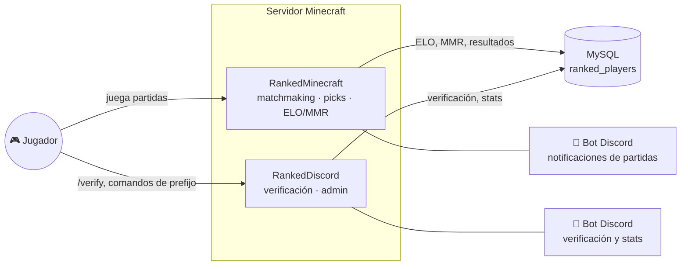

<div align="center">

# ⚔️ RankedMinecraft

**Sistema de matchmaking competitivo para servidores Paper/Spigot con PGM.**
Colas automáticas, picks de capitanes, vetos de mapa, ELO/MMR y estadísticas — con un bot de Discord integrado.

[](https://github.com/FabricioYV/RankedMinecraft/actions/workflows/build.yml)
[](LICENSE)
[](pom.xml)
[](https://pgm.dev/)
[](https://github.com/FabricioYV/RankedDiscord)

[Instalación](#-instalación) • [Comandos](#-comandos) • [Arquitectura](#-arquitectura) • [RankedDiscord](#-el-sistema-completo)

</div>

---

## ✨ Qué hace

RankedMinecraft convierte un servidor PGM en una plataforma de ranked completa:

| | |
|---|---|
| 🎯 **Matchmaking** | Colas automáticas por modo (2v2 / 5v5 / 8v8), balanceadas por MMR |
| 🧢 **Picks de capitanes** | Selección de equipos en vivo, con veto y reroll de capitanes |
| 🗺️ **Vetos de mapa** | Sistema de votación/veto integrado con PGM |
| 📈 **ELO/MMR** | Cálculo diferenciado para partidas de placement vs. partidas normales |
| 🔁 **Requeue** | Reingreso rápido a cola al terminar una partida |
| 🎙️ **Discord en vivo** | Canales de voz temporales por equipo, resultados y logs automáticos |
| 🛡️ **Anti-abandono** | Detección de AFK/desconexión con forfeit y penalización de ELO |

## 🧩 El sistema completo

RankedMinecraft no corre solo — trabaja junto a **[RankedDiscord](https://github.com/FabricioYV/RankedDiscord)**, un segundo plugin que maneja la verificación de cuentas y comandos de administración vía Discord. Ambos comparten la misma base de datos MySQL.



**👉 Para levantar el sistema completo (los dos plugins + la base de datos), seguí [SETUP.md](SETUP.md).**

## 🚀 Instalación

**Opción rápida:** descargá el `.jar` ya compilado desde la [última Release](https://github.com/FabricioYV/RankedMinecraft/releases/latest).

**Compilar vos mismo:**

```bash
git clone https://github.com/FabricioYV/RankedMinecraft.git
cd RankedMinecraft
mvn clean package
```

Copiá el `.jar` de `target/` a `plugins/` de tu servidor, iniciá una vez para generar `config.yml`, apagalo y completá tus credenciales de Discord/MySQL e IDs de canales/roles. Guía completa paso a paso en **[SETUP.md](SETUP.md)**.

Recomendado para JVM en producción (partidas concurrentes, procesamiento asíncrono):

```bash
-Xms2G -Xmx4G -XX:+UseG1GC -XX:MaxGCPauseMillis=200
```

## 📜 Comandos

| Comando | Descripción |
|---|---|
| `/votemap` | Sistema de votación de mapas |
| `/veto` | Vetos de mapa durante la selección |
| `/ff` | Forfeit (rendición) |
| `/ready`, `/r` | Marcar listo |
| `/pick` | Picks de capitanes durante la fase de selección |
| `/requeue` | Reingresar a cola tras una partida |
| `/placement` | Ver estado de placement de un jugador |
| `/mapadmin` | Admin: stats, recent, list, clear, test de mapas |
| `/testplacement` | Admin: análisis avanzado de placement |
| `/elodecay` | Admin: reload/force/info del decay de ELO |

Permisos administrativos vía `ranked.admin` / `rankedmc.admin` (ver `plugin.yml`).

## 🏗️ Arquitectura

- **Matchmaking y partidas**: `ActiveMatch`, `MatchFinisher`, `MapManager`, `QueueManager`.
- **Rating**: ELO (`ProgressiveEloCalculator`, `PlacementRankAssignment`) y MMR (`MMRCalculator`, `PlacementMMRCalculator`), con lógica diferenciada para placement.
- **Integración PGM**: escucha eventos de fin de partida y muertes para actualizar stats y cerrar partidas.
- **Discord**: `DiscordBot` para notificaciones, logs y canales de voz temporales por equipo.
- **Persistencia**: `DatabaseManager` + `BatchProcessor` — escritura en memoria primero, batch asíncrono a MySQL después, para no bloquear el hilo principal.
- **Caches**: TTL en memoria (`PlayerDataCache`) para lookups O(1) durante partidas activas.

**Diseño clave — performance-first**: los jugadores se liberan en memoria de inmediato al terminar una partida; los cambios de ELO/MMR se calculan y persisten de forma asíncrona después, para que el matchmaking nunca espere a la base de datos.

## 🔒 Seguridad

- `config.yml` se distribuye con placeholders (`PUT_..._HERE`) — nunca commitees credenciales reales.
- Los comandos administrativos requieren permisos explícitos (`ranked.admin`, `rankedmc.admin`).
- Antes de migraciones o cambios masivos de rating (decay, etc.), respaldá la base de datos.

## 🤝 Contribuir

Ver [CONTRIBUTING.md](CONTRIBUTING.md) para la convención de ramas y el flujo de Pull Requests.

## 📄 Licencia

[GPL-3.0](LICENSE) — Creado por [FabricioYV](https://github.com/FabricioYV).
